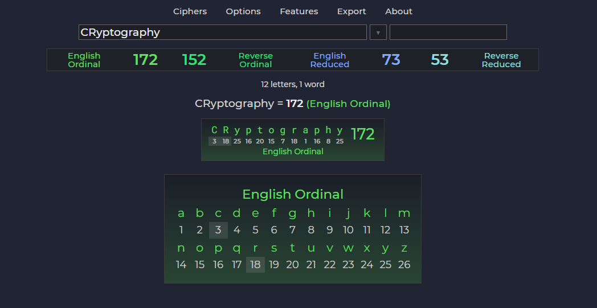

## GEMATRO - Gematria Calculator

> NOTE: Use a desktop Chromium based browser for best experience

### Features:
<ul>
<li>Dynamic highlighter with a filter</li>
<li>Support for diacritical marks</li>
<li>Fully customizable ciphers</li>
    <ul>
        <li>Number substitution</li>
        <li>Letter substitution</li>
        <li>Multicharacter</li>
    </ul>
<li>Database mode</li>
<li>Encoding mode</li>
<li>Import/Export (TXT, CSV)</li>
<li>Unicode and emoji support</li>
</ul>

### Extra:

<ul>
<li>Number properties</li>
<li>Virtual keyboard</li>
<li>Date calculator</li>
<li>Color controls</li>
<li>Screenshot tools</li>
<li>Quickstart guide</li>
</ul>